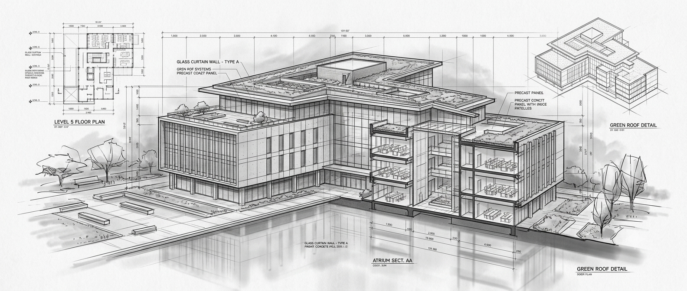
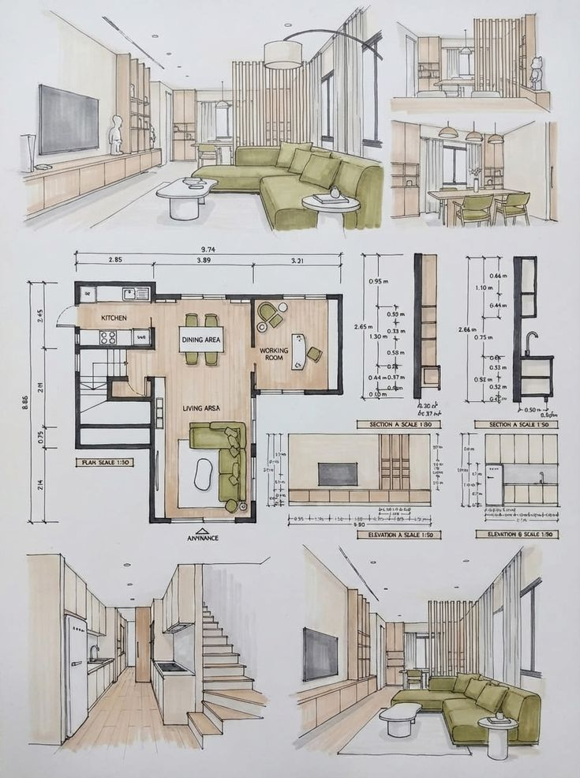
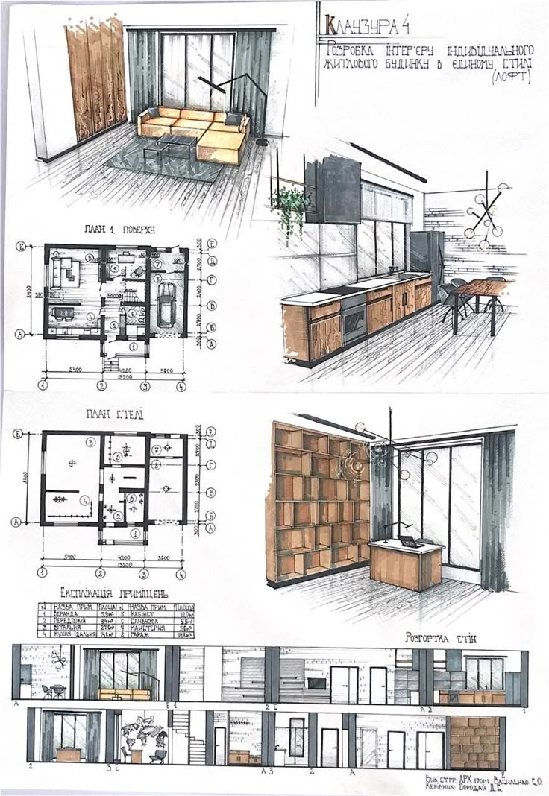
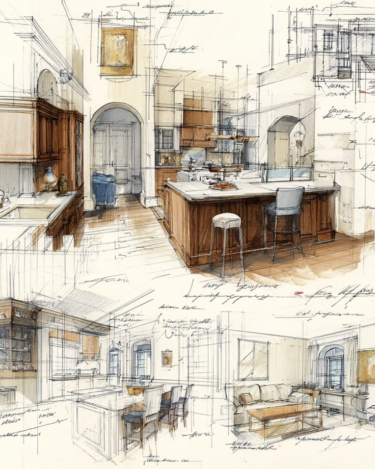

# Livora Property Management Limited

Architectural stewardship for modern legacies. Livora provides residential and commercial property management, brokerage, and valuation services with a focus on long-term stewardship and transparent guidance.



---

## Table of Contents

- [Overview](#overview)
- [Tech Stack](#tech-stack)
- [Features](#features)
- [Screenshots](#screenshots)
- [Project Structure](#project-structure)
- [Getting Started](#getting-started)
- [Scripts](#scripts)
- [Routes](#routes)
- [License](#license)

---

## Overview

Livora is a full-service property management and real estate platform built with Next.js 15, TypeScript, and Tailwind CSS. The application serves property owners, investors, and tenants across residential and commercial markets, offering a cohesive digital experience for property listings, team introductions, career opportunities, and client engagement.



---

## Tech Stack

| Category         | Technology                          |
|------------------|-------------------------------------|
| Framework        | Next.js 15 (App Router)             |
| Language         | TypeScript                          |
| Styling          | Tailwind CSS v4                     |
| UI Components    | shadcn/ui, Radix UI                 |
| Animation        | Motion (Framer Motion)              |
| Icons            | Lucide React, React Icons           |
| Deployment       | Vercel                              |
| Type Checking    | TypeScript (strict)                 |
| Linting          | ESLint + Prettier                   |

---

## Features

- **Property Showcase** — Interactive project gallery with status badges, pricing, and dynamic detail pages (SSG)
- **Team Directory** — Leadership spotlight with department breakdowns and contact information
- **Career Portal** — Job openings with accordion-style detail views and application flow
- **Property Valuation** — Certified valuation services with certified reporting workflow
- **Contact System** — Multi-channel contact form with phone, email, and location integration
- **Theme Support** — Light/dark mode with system preference detection
- **Responsive Design** — Mobile-first layout optimized across all device sizes
- **Static Generation** — SSG for all pages ensuring optimal performance and SEO

---

## Screenshots

### Homepage Hero

The homepage features a full-screen hero with a blueprint grid overlay, architectural imagery, and a clear call-to-action to explore the portfolio.



### Project Detail

Each project has a dedicated detail page with an image gallery, property specifications (beds, baths, area, year built, architect), key features list, and a detailed overview.



### Team Directory

The team page showcases leadership with interactive spotlights, department sections, and contact information for each team member.


### Testimonials

Client testimonials are displayed with a carousel navigation, animated transitions, and responsive image layouts.

---

## Project Structure

```
.
├── app/
│   ├── (application)/              # Route group for application pages
│   │   ├── _components/            # Shared page components
│   │   │   ├── blogPreview.tsx
│   │   │   ├── gallery.tsx
│   │   │   ├── hero.tsx
│   │   │   ├── onGoing.tsx
│   │   │   ├── projectPreview.tsx
│   │   │   ├── searchBar.tsx
│   │   │   └── testimonialSection.tsx
│   │   ├── about/                  # About page and sub-components
│   │   ├── career/                 # Career page and openings
│   │   ├── connect/                # Client and landowner flows
│   │   ├── contact/                # Contact form and details
│   │   ├── projects/               # Project listing and detail pages
│   │   ├── team/                   # Team directory
│   │   ├── layout.tsx              # Application layout
│   │   └── page.tsx                # Homepage
│   ├── globals.css                 # Global styles and theme variables
│   └── layout.tsx                  # Root layout
├── components/
│   ├── app/                        # Application-specific components
│   │   ├── shared/                 # Navbar, footer
│   │   ├── call-to-action.tsx
│   │   └── page-hero.tsx
│   ├── logo.tsx                    # Livora icon component
│   └── ui/                         # shadcn/ui components
├── lib/
│   ├── constants/                  # FAQ, project data, career data
│   └── types/                      # TypeScript interfaces
├── public/                         # Static assets
└── assets/                         # Imported image assets
```

---

## Getting Started

### Prerequisites

- Node.js 18+
- npm or yarn

### Installation

```bash
git clone <repository-url>
cd dpml
npm install
```

### Development

```bash
npm run dev
```

Open [http://localhost:3000](http://localhost:3000) to view the application in development mode.

### Build

```bash
npm run build
```

Creates an optimized production build in the `.next/` directory.

### Linting

```bash
npm run lint
```

Runs ESLint to check for code quality and style issues.

---

## Routes

| Route                        | Description                          |
|------------------------------|--------------------------------------|
| `/`                          | Homepage with hero, projects, testimonials |
| `/about`                     | About page with mission, stats, team |
| `/projects`                  | Project listing grid                 |
| `/projects/[slug]`           | Individual project detail (6 pages)  |
| `/team`                      | Team directory with departments      |
| `/career`                    | Career page with job openings        |
| `/connect`                   | Client and landowner connection      |
| `/contact`                   | Contact form and office information  |
| `/privacybeleid`             | Privacy Policy                       |
| `/algemene-voorwaarden`      | Terms & Conditions                   |

---

## Layout System

The application uses a consistent layout system managed through `PageHero` and `CallToAction` components:

- **PageHero** — Standardized section header with badge, title, and description
- **CallToAction** — Full-width footer call-to-action with buttons and accent styling

Both components use the blueprint grid motif and accent color palette for visual consistency.

---

## Theme

The application supports light and dark modes via `next-themes`, with a warm paper / ink color palette defined in `globals.css`:

- **Background**: Warm paper white (`#FAFAF8`)
- **Foreground**: Deep ink (`#15171A`)
- **Accent**: Muted bronze (`#8C7B5E`)
- **Border**: Hairline ink at low alpha

---

## License

Livora Property Management Limited. All rights reserved.
